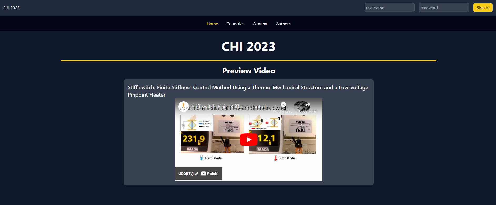
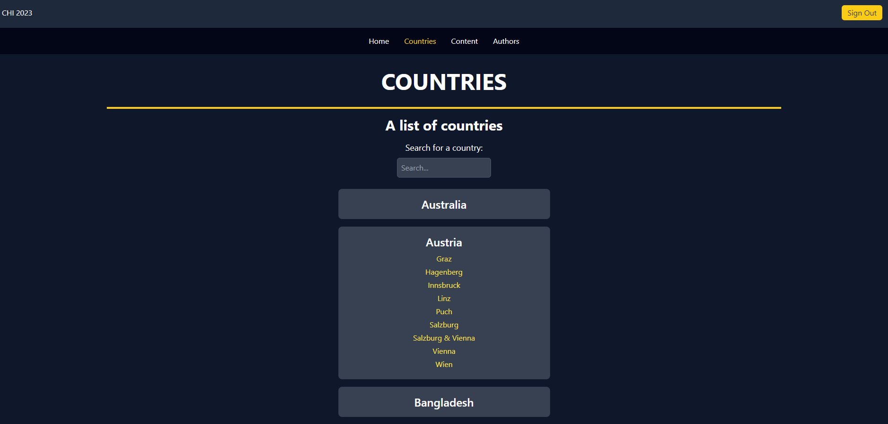
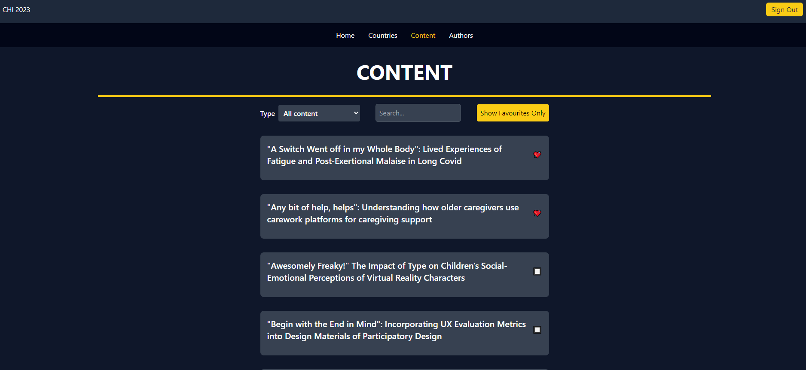
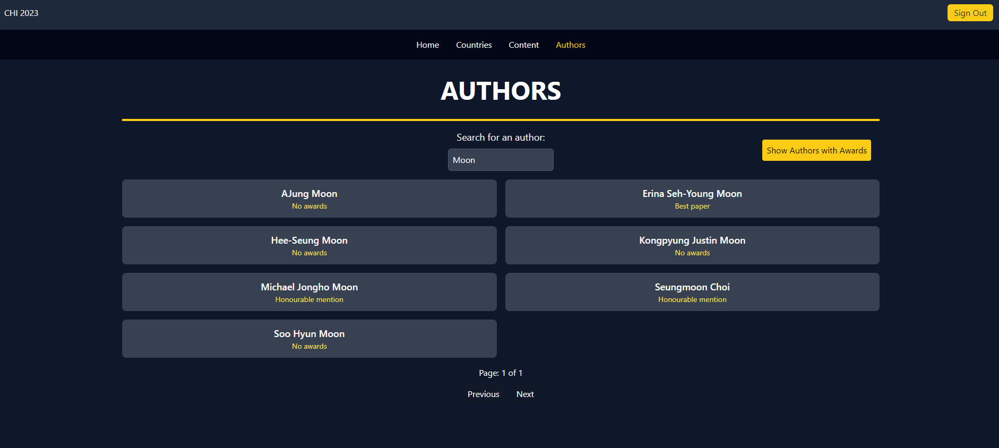

# React Test Website

This repository contains a test website built with React, designed to showcase various features such as fetching data from an API, state management, and basic UI components. The whole project (API + React) was created by Karol Fryc.

## Purpose

The primary aim of this project is to demonstrate:
- Data fetching from an API
- State management in React
- Basic routing and navigation
- Interactive UI elements

## Live Demo

You can view the live demo of the website (might get unavailable soon as I need a different hosting server) [here](https://w21030911.nuwebspace.co.uk/coursework/react/).

## Pages and Features










### Data Fetching Example

- Demonstrates fetching data from the API.
- Displays fetched data in a user-friendly format.

### State Management

- Example of managing state within the application.
- Interactive elements to modify and display state.

### Navigation

- Basic routing between different pages.
- Demonstrates the use of React Router for navigation.

## Getting Started

To run this project locally:

1. Clone the repository:
    ```sh
    git clone https://github.com/your-username/react-test-website.git
    ```
2. Navigate to the project directory:
    ```sh
    cd react-test-website/React
    ```
3. Install dependencies:
    ```sh
    npm install
    ```
4. Start the development server:
    ```sh
    npm start
    ```

## Conclusion

This test website is a simple project aimed at demonstrating core React concepts and features. Feel free to explore the code, try out the features, and use it as a reference for your own React projects.
